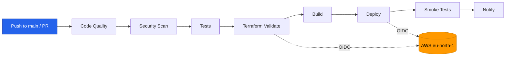
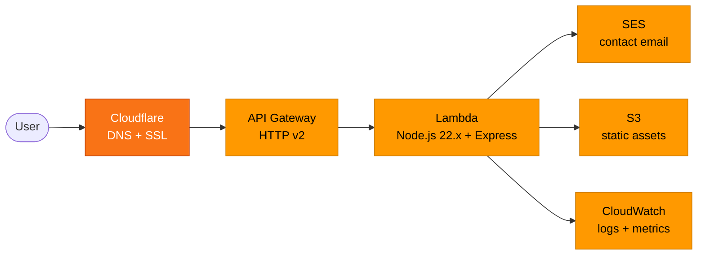

# 🚀 Ankit Raj Portfolio

[](https://github.com/restlessankyyy/my-portfolio-app/actions/workflows/ci-cd.yml)
[](https://github.com/restlessankyyy/my-portfolio-app/actions/workflows/codeql.yml)
[](https://nodejs.org/)
[](LICENSE)

Premium cinematic portfolio website for **Ankit Raj**, Lead Solution Architect and Multi-Cloud Engineer specializing in AWS, Azure, and GCP.

🌐 **Live Site:** [https://www.ankitraj.cloud](https://www.ankitraj.cloud)

## ✨ Features

- 🎬 **Cinematic Dark Theme** with grain overlay and parallax
- 🖱️ **Custom Cursor** that reacts to interactive elements
- ✍️ **Typing Effect** cycling through roles and specialties
- 🎨 **Glassmorphism Nav** with scroll progress indicator
- 🌙 **Dark/Light Mode** persisted via localStorage
- 🏷️ **Project Filters** (Enterprise, Open Source, AI)
- 📜 **Animated Experience Timeline** and certifications marquee
- 📄 **Auto-generated Resume PDFs** via Puppeteer and GitHub Actions
- 🤖 **Agentic Resume Pipeline**: 4-agent AI system (Azure OpenAI or Claude) builds ATS-optimized resumes from job descriptions
- 📱 **Fully Responsive** (1024 / 768 / 480px breakpoints)
- ⚡ **Serverless** on AWS Lambda and API Gateway
- 🔒 **Secure**: keyless OIDC deploys, HTTPS, DKIM/SPF/DMARC, CodeQL, Dependabot
- 📧 **Contact Form** via EmailJS with AWS SES fallback
- 🏗️ **Infrastructure as Code** with Terraform for AWS and Cloudflare

## 🛠️ Tech Stack

| Category | Technologies |
|----------|-------------|
| **Frontend** | HTML5, CSS3 (custom properties, glassmorphism), Vanilla JS (ES6+ classes) |
| **Fonts** | Space Grotesk, JetBrains Mono |
| **Icons** | Font Awesome 6.5.0 |
| **Backend** | Node.js 24 (dev/CI), Express.js |
| **Runtime** | AWS Lambda (Node.js 22.x) |
| **PDF Gen** | Puppeteer (HTML to PDF) |
| **Cloud** | AWS Lambda, API Gateway, SES, ACM, S3 |
| **DNS/CDN** | Cloudflare (DNS, SSL, Page Rules) |
| **IaC** | Terraform (AWS + Cloudflare) |
| **CI/CD** | GitHub Actions (7 workflows), keyless AWS via OIDC |
| **Security** | CodeQL, Dependabot, npm audit, Dependency Review, Secret Scanning |

## 📁 Project Structure

| Path | Purpose |
|------|---------|
| `public/` | Static frontend served by Express (HTML, CSS, JS, images) |
| `scripts/` | Resume HTML templates and Puppeteer PDF generators |
| `scripts/agent/` | Agentic Resume Pipeline (4 agents: JD Analyzer, Experience Mapper, Resume Writer, ATS Scorer) |
| `terraform/` | Infrastructure as Code (AWS, Cloudflare, OIDC, remote state) |
| `docs/` | Architecture, pipeline, CI/CD, and deployment guides |
| `.github/` | GitHub Actions workflows and Dependabot config |
| `tests/` | Unit tests (8 cases) |
| `server.js` / `lambda.js` | Express server and AWS Lambda handler |

## 📚 Documentation

| Doc | Description |
|-----|-------------|
| [docs/architecture.md](docs/architecture.md) | System architecture: AWS, Cloudflare, remote state |
| [docs/agentic-pipeline.md](docs/agentic-pipeline.md) | 4-agent AI resume pipeline: architecture, usage, CI/CD |
| [docs/cicd.md](docs/cicd.md) | All GitHub Actions workflows reference |
| [docs/deployment.md](docs/deployment.md) | Deployment guide, Terraform config, secrets |
| [docs/contributing.md](docs/contributing.md) | Contributing guidelines |

## 🚀 Quick Start

### Prerequisites

- Node.js 24+ (`nvm install 24`)
- npm 11+
- AWS CLI configured (for deployment)
- Terraform 1.0+ (for infrastructure)

### Local Development

```bash
# Clone the repository
git clone https://github.com/restlessankyyy/my-portfolio-app.git
cd my-portfolio-app

# Install dependencies
npm install

# Start development server
npm start
# → http://localhost:3000

# Start with hot reload
npm run dev
```

### Generate Resume PDFs

```bash
# Generate primary resume (AWS SA variant)
node scripts/generate-pdf-aws-sa.js
# → Output: public/assets/Profile.pdf

# Generate Nordic photo resume
node scripts/generate-pdf-photo.js
# → Output: public/assets/Profile-Nordic.pdf
```

### Available Scripts

| Command | Description |
|---------|-------------|
| `npm start` | Start production server on port 3000 |
| `npm run dev` | Start with hot reload (nodemon) |
| `npm test` | Run unit tests (8 test cases) |
| `npm run lint` | Run ESLint on JS files |
| `npm run lint:fix` | Auto-fix lint issues |
| `npm run format` | Format with Prettier |
| `npm run format:check` | Check formatting |
| `npm run validate` | Run lint + format check + tests |
| `npm run build` | Minify CSS + JS for production |
| `npm run deploy` | Deploy to AWS via Terraform |
| `npm run deploy:destroy` | Tear down AWS infrastructure |

## 🏗️ Infrastructure

### AWS Resources

- **Lambda Function** `portfolio-ankit-prod-*` (Node.js 22.x, 512MB, 30s timeout)
- **API Gateway** HTTP API v2 with CORS
- **ACM Certificate** SSL for custom domain
- **SES** email sending with DKIM verified
- **S3** static assets and Terraform state
- **CloudWatch** logs (14-day retention) and metrics

### Cloudflare

- **DNS** A, CNAME, TXT records
- **SSL** Full (strict) mode
- **Page Rules** root domain redirect to www

### Remote State

Terraform state is stored in S3 with DynamoDB locking:

- **Bucket**: `portfolio-ankit-terraform-state`
- **Lock Table**: `portfolio-ankit-terraform-locks`

## 🔄 CI/CD Pipeline

Pushes to `main` and pull requests run the full pipeline. All AWS access is keyless: every AWS-touching job assumes an IAM role via GitHub OIDC, so no static AWS keys are stored.



See [docs/cicd.md](docs/cicd.md) for the full workflow reference and stage detail.

| Workflow | Trigger | Purpose |
|----------|---------|---------|
| **ci-cd.yml** | Push / PR to `main` | Full pipeline: quality, scan, test, terraform, build, deploy, smoke |
| **codeql.yml** | Push/PR to `main` + weekly | CodeQL security analysis for JavaScript |
| **resume-pdf.yml** | Push (resume HTML changes) + manual | Regenerate Profile.pdf |
| **resume-nordic-pdf.yml** | Push (resume-photo.html changes) + manual | Regenerate Profile-Nordic.pdf |
| **agentic-resume.yml** | Push (`jds/*.txt`) + manual | 4-agent resume pipeline via Claude (Anthropic) |
| **agentic-resume-foundry.yml** | Push (`jds/*.txt`) + manual | 4-agent resume pipeline via Azure OpenAI (Foundry) |
| **docs-lint.yml** | Push/PR (docs changes) | Markdown lint and link check |

### Dependabot

- **npm**: weekly Monday updates, grouped by dev/prod
- **GitHub Actions**: weekly Monday updates, grouped
- **Labels**: `dependencies`, `ci`
- **PR limit**: 10 open PRs max

### Required Secrets

See [docs/deployment.md](docs/deployment.md) for the full secrets and IAM permissions.

## 🔁 Application Lifecycle

```mermaid
flowchart LR
    DEV[Local dev]:::dev --> VAL[npm run validate]
    VAL --> PR[Open PR to main]
    PR --> CI[CI checks]
    CI --> MERGE[Merge to main]:::main
    MERGE --> CD[Keyless deploy via Terraform]
    CD --> INFRA[AWS Lambda + API Gateway]:::aws
    INFRA --> CDN[Cloudflare DNS + SSL]
    CDN --> PROD[Live: www.ankitraj.cloud]:::prod

    classDef dev fill:#10b981,stroke:#047857,color:#fff
    classDef main fill:#2563eb,stroke:#1e40af,color:#fff
    classDef aws fill:#ff9900,stroke:#cc7a00,color:#000
    classDef prod fill:#7c3aed,stroke:#5b21b6,color:#fff
```



## 🤖 Agentic Resume Pipeline

A 4-agent AI system (JD Analyzer, Experience Mapper, Resume Writer, ATS Scorer) that generates ATS-optimized resume PDFs. Supports **Azure OpenAI (gpt-5.4)** and **Anthropic Claude**.

```bash
# Run locally
node scripts/agent/generate.js --jd scripts/agent/jds/microsoft-csa.txt --model gpt-5.4
```

See [docs/agentic-pipeline.md](docs/agentic-pipeline.md) for full architecture, design decisions, and CI/CD integration.

## 📊 Architecture



See [docs/architecture.md](docs/architecture.md) for full resource details.

## 🧪 Testing

```bash
npm test

# Expected output:
# 🧪 Running Server Tests...
# ✅ Health endpoint returns 200
# ✅ Health endpoint returns JSON
# ✅ Homepage returns HTML
# ✅ Static CSS is served
# ✅ Static JS is served
# ✅ Contact API requires fields
# ✅ Contact API validates email
# ✅ Unknown routes return index.html (SPA)
# 📊 Results: 8 passed, 0 failed
```

## 🛡️ Security

- **CodeQL** static analysis for JavaScript vulnerabilities
- **Dependabot** automated dependency updates
- **npm audit** CI check for known CVEs (0 vulnerabilities)
- **Dependency Review** blocks vulnerable dependencies on PRs (GitHub Advisory DB)
- **Secret Scanning + Push Protection** native secret detection
- **OIDC** keyless AWS deploys (no static credentials in CI)
- **npm overrides** pinned `fast-xml-parser >=5.3.8` to patch CVEs
- **IAM** least-privilege roles for Lambda and deploy
- **API Gateway** throttling configured
- **HTTPS** full strict SSL via Cloudflare

## 🚢 Deployment

See [docs/deployment.md](docs/deployment.md) for the full deployment guide, Terraform config, and infrastructure details.

## 📝 Contributing

See [docs/contributing.md](docs/contributing.md) for guidelines.

## 📜 License

This project is licensed under the MIT License. See the [LICENSE](LICENSE) file for details.

## 👤 Author

**Ankit Raj**, Lead Solution Architect and Multi-Cloud Engineer

- 🌐 Website: [ankitraj.cloud](https://www.ankitraj.cloud)
- 💻 GitHub: [@restlessankyyy](https://github.com/restlessankyyy)
- 💼 LinkedIn: [Ankit Raj](https://www.linkedin.com/in/raj-ankit/)
- 📧 Email: <rajankit749@gmail.com>

---

⭐ Star this repo if you find it helpful!
