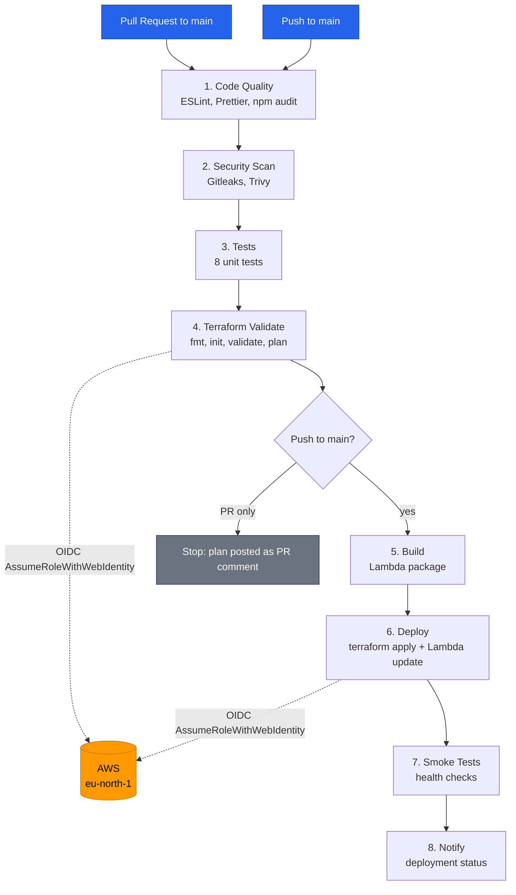

# CI/CD Pipeline

## Workflows

| Workflow | Trigger | Purpose |
|----------|---------|---------|
| `ci-cd.yml` | Push to `main`, PRs to `main` | Full pipeline: lint → scan → test → build → deploy → smoke test |
| `codeql.yml` | Push/PR to `main` + weekly | CodeQL static analysis for JavaScript |
| `security-scan.yml` | Weekly + manual | Gitleaks (secrets) + Trivy (vulnerabilities) |
| `security-audit.yml` | Push/PR (package changes) | npm audit + outdated packages |
| `resume-pdf.yml` | Push (`resume-aws-sa.html`) + manual | Auto-regenerate Profile.pdf |
| `resume-nordic-pdf.yml` | Push (`resume-photo.html`) + manual | Auto-regenerate Profile-Nordic.pdf |
| `agentic-resume.yml` | Push (`jds/*.txt`) + manual | 4-agent resume pipeline via Anthropic Claude |
| `agentic-resume-foundry.yml` | Push (`jds/*.txt`) + manual | 4-agent resume pipeline via Azure OpenAI (Foundry) |
| `dependency-update.yml` | Weekly (Sunday 2am UTC) | Check for dependency updates |

## Main CI/CD Pipeline Stages

```text
Code Quality → Security Scan → Tests → Terraform Validate → Build → Deploy → Smoke Tests → Notify
```



> AWS access is keyless: every AWS-touching job assumes the `portfolio-ankit-github-deploy` IAM role via GitHub OIDC (`id-token: write` + `AWS_ROLE_ARN`). No static AWS keys are stored.

| Stage | Job | What it does |
|-------|-----|-------------|
| 1 | `code-quality` | ESLint, Prettier, npm audit |
| 2 | `security-scan` | Gitleaks, Trivy |
| 3 | `test` | Unit tests (8 cases) |
| 4 | `terraform-validate` | IaC format check + plan |
| 5 | `build` | Lambda package creation |
| 6 | `deploy` | Terraform apply + Lambda update |
| 7 | `smoke-tests` | Post-deploy health checks |
| 8 | `notify` | Deployment status notification |

## Application Lifecycle

End-to-end flow from a local change to the live site at `www.ankitraj.cloud`.

```mermaid
flowchart LR
    DEV[Local dev<br/>npm run dev]:::dev --> VAL[npm run validate<br/>lint, format, tests]
    VAL --> COMMIT[Commit<br/>conventional prefix]
    COMMIT --> BRANCH[Feature branch]
    BRANCH --> OPENPR[Open PR to main]
    OPENPR --> CI[CI checks<br/>quality, scan, test, tf plan]
    CI --> REVIEW{Review<br/>approved?}
    REVIEW -- "changes requested" --> DEV
    REVIEW -- "approved" --> MERGE[Merge to main]:::main
    MERGE --> CD[CD pipeline<br/>build, deploy, smoke]
    CD --> INFRA[AWS Lambda + API Gateway<br/>eu-north-1]:::aws
    INFRA --> CDN[Cloudflare DNS + SSL<br/>full strict]
    CDN --> PROD[Live: www.ankitraj.cloud]:::prod

    classDef dev fill:#10b981,stroke:#047857,color:#fff
    classDef main fill:#2563eb,stroke:#1e40af,color:#fff
    classDef aws fill:#ff9900,stroke:#cc7a00,color:#000
    classDef prod fill:#7c3aed,stroke:#5b21b6,color:#fff
```



## Paths-Ignore

Changes to `scripts/agent/**` do **not** trigger the main CI/CD pipeline (docs/agent code only). Only `jds/*.txt` additions trigger the agentic workflows.

## Dependabot

- **npm** — Weekly Monday updates, grouped by dev/prod
- **GitHub Actions** — Weekly Monday updates
- **Labels**: `dependencies`, `ci`
- **PR limit**: 10 open PRs max

## Required Secrets

See [deployment.md](deployment.md) for the full secrets list. Additional secrets for the agentic pipeline are in [agentic-pipeline.md](agentic-pipeline.md#github-secrets).
