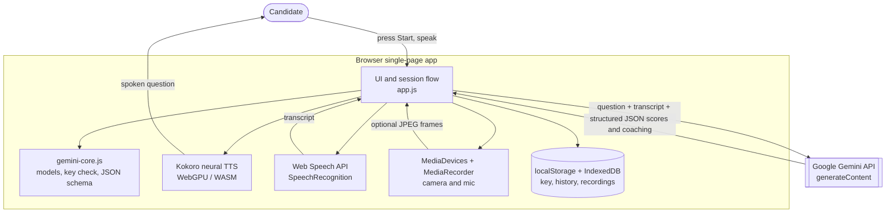
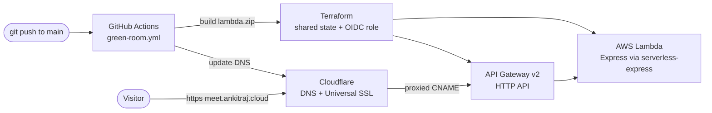

# Green Room: Senior SA Interview Practice

Green Room is a browser-based interview practice tool for Senior Solutions Architect prep.

It gives you:

- Track-based interview sessions
- A Start gate: the virtual interviewer reads each question aloud once you press Start
- Timed answers with target ranges
- Optional camera and mic recording
- Live browser speech-to-text (when supported)
- AI scoring and coaching with a free Google Gemini key (bring your own key)
- Optional on-camera delivery analysis (Gemini multimodal, opt-in)
- Session history and local progress tracking
- Exportable report view

## Tech Stack

- Plain HTML/CSS/JavaScript
- No build step
- Browser APIs:
  - MediaDevices and MediaRecorder
  - Web Speech API (SpeechRecognition or webkitSpeechRecognition) for transcription
  - IndexedDB for local recordings
  - localStorage for app data
- In-browser neural TTS: Kokoro (WebGPU with WASM fallback)
- AI: Google Gemini `generateContent` REST (structured JSON output, optional image parts)
- Runtime: Node/Express served locally and on AWS Lambda (serverless-express)

## Project Structure

- `public/index.html`: UI layout and screens
- `public/styles.css`: visual styling
- `public/questions.js`: question bank, tracks, and timing targets
- `public/gemini-core.js`: shared Gemini helpers (model list, key check, URL, JSON schema mapping)
- `public/app.js`: app logic, recording, transcription, Gemini evaluation, voice, reports
- `server.js`: tiny Express server that serves `public/` and a `/health` endpoint
- `lambda.js`: AWS Lambda handler wrapping the Express app (serverless-express)
- `terraform/`: AWS (Lambda + API Gateway) and `terraform/cloudflare/` (DNS) infra
- `scripts/build-lambda.sh`: builds the Lambda deployment package
- `scripts/smoke-gemini.js`: live Gemini smoke test (reads `GEMINI_API_KEY`)
- `tests/`: Node `--test` unit tests for `gemini-core`

## Architecture

Green Room is a static single-page app served by a thin Express shell. All
session logic, AI calls, voice, and storage run in the browser. Your Gemini key
and data never touch the server: the browser calls the Gemini API directly.

### Runtime (in the browser)



### Hosting and deployment



TLS is terminated by Cloudflare (Universal SSL); `meet.ankitraj.cloud` is a
proxied CNAME to the API Gateway default endpoint, so there is no ACM
certificate to manage.

## Quick Start

The app is static, but it is served through a small Express server so the same
code runs locally and on AWS Lambda.

```bash
cd green-room
npm install
npm start   # http://localhost:3000
```

You can still serve the static files directly for quick UI work:

```bash
python3 -m http.server 8000 --directory public   # http://localhost:8000
```

## AI Evaluator Setup

Green Room uses Google Gemini for scoring and coaching. Bring your own key: get a
free one (no card) at [aistudio.google.com/apikey](https://aistudio.google.com/apikey)
and paste it into the setup panel. The key is stored only in your browser and is
sent directly to the Gemini API from your browser.

A valid AI Studio key starts with `AIza`. The app validates the key on the first
real call rather than by prefix alone.

### Gemini models

Use the Gemini model dropdown in the UI to pick a model.
Current options include:

- `gemini-3.5-flash` (default)
- `gemini-3.1-pro-preview`
- `gemini-2.5-pro`
- `gemini-2.5-flash`
- `gemini-2.5-flash-lite`

### Optional on-camera delivery analysis

Tick "Also analyze my on-camera delivery" to include a few sampled JPEG frames
from your camera with the answer. Gemini then comments on presence and delivery
alongside content. It is off by default and uses more Gemini quota.

### No API key mode

You can still run sessions without a key.
In that mode, timing, transcript, and recording features work, but AI feedback is skipped.

## Virtual interviewer

The session screen shows an animated interviewer avatar. After you press
**Start interview**, it reads each question out loud (browsers block autoplay
until that first click).

The voice is Kokoro neural TTS running fully in your browser, so it sounds like a
real human rather than a robotic system voice. The model (~86MB) downloads once
and is cached by the browser; WebGPU is used automatically when available,
otherwise WASM. The avatar's mouth moves in real time from the actual audio
waveform, so it looks like the interviewer is speaking.

Controls (session sidebar):

- Interviewer voice on/off
- Interviewer voice selector (American/British, male/female)
- Replay question, Stop voice
- Shortcut: press Q to replay the current question audio

### Making it look like a real live interview

For a photorealistic, lip-synced human face, the app can be extended with:

- A 3D talking-head avatar (for example the open-source TalkingHead library with a Ready Player Me avatar), driven by the same in-browser Kokoro audio for real lip-sync. Fully client-side, no paid API.
- Or a hosted talking-avatar video service (HeyGen, D-ID, Azure TTS Avatar) for a real human face, which requires an API key and network calls.

## Deployment (meet.ankitraj.cloud)

Green Room is a self-contained subproject of `my-portfolio-app`. It deploys to
`https://meet.ankitraj.cloud` on AWS Lambda + API Gateway and reuses the repo's
shared plumbing: the same Terraform state bucket and lock table, the same GitHub
OIDC deploy role (`AWS_ROLE_ARN`), and the same Cloudflare zone. The portfolio
app and its pipeline are untouched.

The pipeline is `.github/workflows/green-room.yml`, path-filtered to
`green-room/**`. On push to `main` it runs lint, the Node test suite, and a
browser-script syntax check, validates Terraform, builds the Lambda package,
applies the Terraform, updates the function code (keyless via OIDC), and updates
Cloudflare DNS.

TLS is handled entirely by Cloudflare: `meet.ankitraj.cloud` is a proxied CNAME
to the API Gateway default endpoint, so Cloudflare's Universal SSL terminates
public HTTPS and connects to the AWS origin over its built-in `*.execute-api`
certificate. There is no ACM certificate to manage.

### One-time setup

Add repository secrets: `CLOUDFLARE_API_TOKEN`, `CLOUDFLARE_ZONE_ID` (reusing the
existing `AWS_ROLE_ARN`, and optionally `CF_PROBE_SECRET`). No ACM/certificate
secrets are needed.

Infra config lives in `terraform/terraform.tfvars.example` and
`terraform/cloudflare/terraform.tfvars.example`.

## Testing

```bash
cd green-room
npm test                 # Node --test unit tests for gemini-core
node --check public/app.js public/gemini-core.js   # browser-script syntax check
```

To smoke-test a real Gemini key end to end:

```bash
GEMINI_API_KEY=AIza... node scripts/smoke-gemini.js
```

## Data and Privacy

- API keys are stored only in this browser (localStorage).
- Session summaries and scores are stored only in this browser (localStorage).
- Recordings are stored locally in IndexedDB.
- Only question text and transcript (and, if you opt in, a few camera frames) are sent to the Gemini API for scoring.

## Browser Notes

- Best experience: latest Chrome or Edge.
- Safari and some browsers may not support live speech transcription.
- If camera or mic fails, you can still type answers manually.

## Typical Workflow

1. Select a track.
2. Choose session length and difficulty.
3. Optionally select Gemini model and add API key.
4. Start answering with recording and transcription.
5. Submit for feedback.
6. Review end-of-session report and history.

## Troubleshooting

- Camera or mic denied:
  - Enable permission in browser site settings.
  - Reload page and retry.
- No transcript appearing:
  - Use Chrome or Edge.
  - Confirm mic permission.
  - Type directly in transcript box as fallback.
- AI evaluation failed:
  - Verify key format and validity.
  - Check selected model name.
  - Retry evaluation from the feedback panel.

## License

No license file is currently included in this repository.
